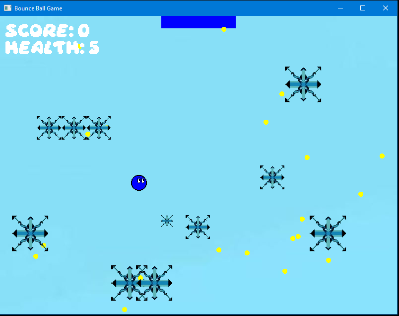
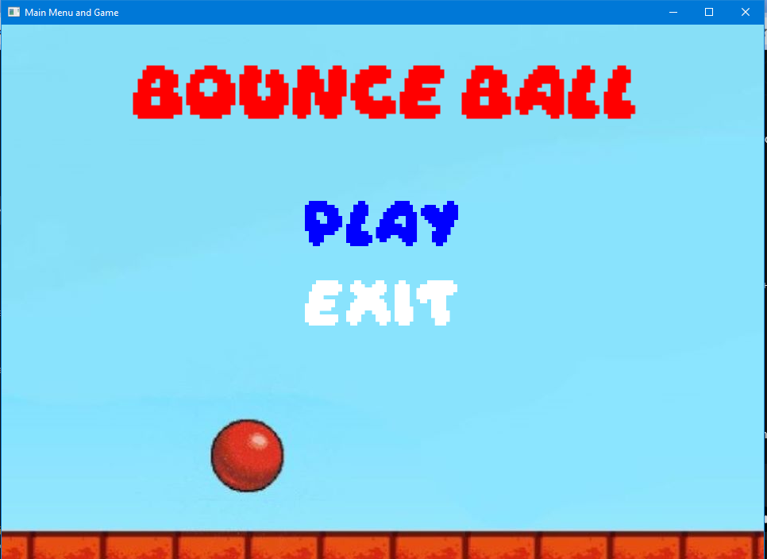
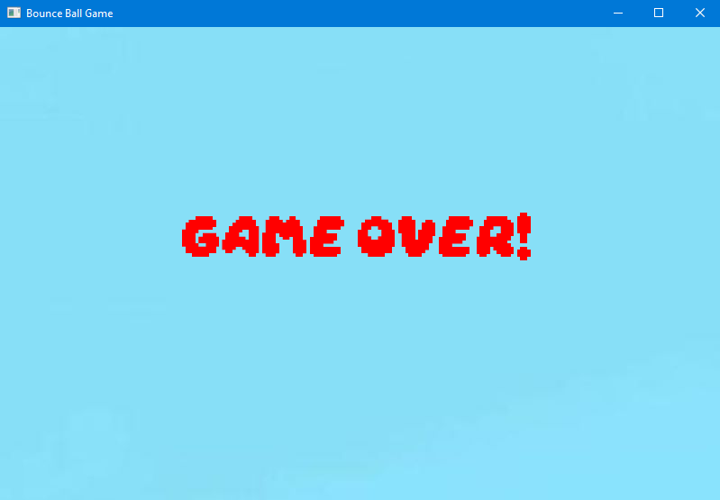

# Bouce Ball  

  

## Introduction
The game was developed on MinGW64 using Msys2 and Visual Studio Code.
Bounce Ball is a video game where players control a ball. The objective is to guide the Ball through a series of levels full of obstacles and challenges, avoiding dangers and collecting bonuses. Use the 'A', 'D', 'W' and 'S' keys to move the ball to the left, right, up and down. 
The ball must reach the goal, avoiding colliding with the obstacles that confront it. Each time the ball touches the goal, the level will change, as well as the location of the obstacles

## Gameplay
    First, you need to choose between the "Play" and "Exit" options from the main menu. To select an option, use the up or down directional keys, and then click Enter.

    Use the A, D, W, and S keys to move the ball to the left, right, up and down

## How to run
To run the game, run the following command in the Terminal:
> make run08_Tron
